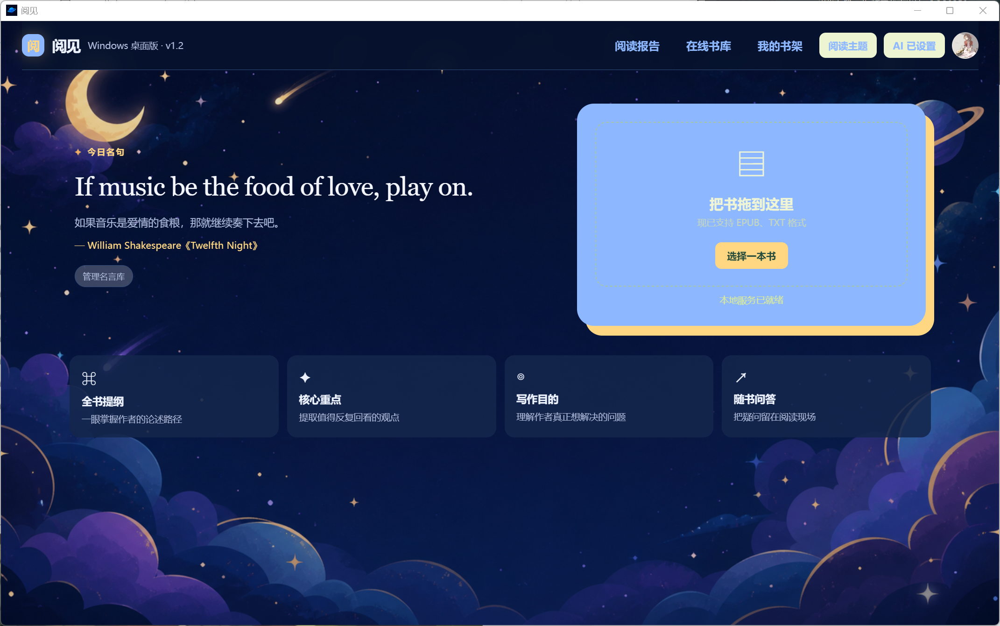

# 阅见 Reader 1.4.3

阅见是一款面向 Windows、Android 手机和平板的本地优先 AI 电子书阅读器，支持 EPUB/TXT 阅读、分章深度分析、精确批注、多色高亮、阅读报告、本地书架和多种阅读主题。



## 直接使用

运行：

```text
dist/Yuejian-Reader-1.4.3.exe
```

Android 正式安装包构建后位于：

```text
android/release/Yuejian-Android.apk
```

首次使用时，在右上角“AI 设置”中选择服务商、填写模型名称和自己的 API 密钥。密钥使用 Windows DPAPI 加密，只能由当前 Windows 账户解密。

应用服务仅绑定 `127.0.0.1`，每次启动随机选择端口并生成临时访问令牌；接口还会校验 Host、Origin 和同源 Cookie，不向局域网开放。

## 主要功能

- EPUB/TXT 解析、真实目录标题、章节跳转、图片、脚注和基础排版。
- 长书自适应分块分析、分块结果断点缓存、失败重试和主动取消。
- AI 报告结构校验、完整结果原子保存和二次补充修订。
- 连续滑动和左右翻页，章节可持续衔接。
- 原文选段、精确批注、多色高亮、删除标记和 AI 选段解析。
- 本地书架、封面、阅读进度、日/周/月/年阅读报告。
- 中文维基文库、Project Gutenberg 和自定义书库网站入口。
- 主题、自定义背景、本地头像和名言库。
- 书籍删除、缓存清理、存储统计、完整数据备份/恢复和诊断信息。
- Android 手机、横屏、分屏、中型平板和大屏布局适配。
- 可选账户模式与偶尔在线同步：Windows 按需作为局域网服务器，关闭服务器后各端继续本地使用。
- 多端书架取并集，阅读统计按设备贡献累加；删除书籍、批注和报告会同步删除墓碑。
- 已生成的 AI 报告可跨端查看，接收端无需配置 API 密钥，也不会重复分析。

## 账户与多端同步

账户功能默认关闭，本地模式不会连接同步服务器。需要更新多端数据时：

1. 双击项目根目录的 `阅见同步服务器.exe`，保持服务器窗口打开。
2. 电脑与手机连接同一局域网或 Wi-Fi；桌面版直接连接本机，安卓版会自动发现服务器。
3. 软件内只需填写用户名和密码：首台设备注册账户，其他设备登录同一账户。
4. 同步完成后可关闭服务器窗口；各设备仍可离线阅读，下次开启服务器后会补传未同步变更。

同步服务器只建议用于可信家庭/办公局域网。首次启动时 Windows 可能询问防火墙权限，请允许“专用网络”。公网使用必须另行配置 HTTPS 或可信隧道。Windows 阅读服务仍只绑定 `127.0.0.1`；独立账户服务器使用 TCP 18787 和 UDP 8788 自动发现。AI API 密钥、登录令牌、本机路径和诊断日志不会进入同步数据。

## 源码运行

支持 Python 3.11–3.13。推荐先执行一次构建脚本，它会自动创建 `.venv` 并安装锁定依赖：

```powershell
.\build.ps1
```

也可以手动运行服务：

```powershell
python -m venv .venv
.\.venv\Scripts\python.exe -m pip install -r requirements-build.txt
.\.venv\Scripts\python.exe server.py
```

服务启动后会在默认浏览器打开带一次性令牌的本机地址。令牌随即写入 HttpOnly Cookie，并从地址栏移除。

## 测试与构建

运行测试：

```powershell
.\.venv\Scripts\python.exe -m pytest
node --check assets\app.js
```

Android 测试和构建：

```powershell
cd android
.\build-android.ps1
```

一键构建：

```text
构建Windows软件.cmd
```

构建流程会：

1. 自动创建 Python 3.13 虚拟环境。
2. 安装 `requirements-build.txt` 中锁定的依赖。
3. 运行 Python 测试。
4. 使用 PyInstaller 生成单文件 Windows 程序。
5. 运行 `reader.exe --self-test` 验证打包产物。

最终产物固定为：

```text
dist/reader.exe
```

## 项目结构

```text
book/
├─ assets/
│  ├─ app.css                 # 页面样式
│  ├─ app.js                  # 阅读器与业务交互
│  ├─ ui-storage.js           # 增量状态同步
│  ├─ accessibility.js        # 弹窗、键盘和 ARIA 行为
│  └─ 图片与图标资源
├─ tests/                     # 解析、安全、备份和并发测试
├─ android/                   # 独立 Android 原生工程与 WebView 阅读界面
├─ docs/screenshots/          # README 项目截图
├─ ai_client.py               # OpenAI/DeepSeek 请求适配与重试
├─ storage.py                 # 跨线程/进程锁与原子持久化
├─ server.py                  # 解析、书架、AI 工作流与本地 API
├─ sync_server.py             # 可按需开启的账户与局域网同步服务器
├─ sync_local.py              # Windows 本地队列、离线续传与数据合并
├─ desktop.py                 # pywebview 桌面入口和单实例控制
├─ index.html                 # 页面结构
├─ pyproject.toml             # 项目与依赖声明
├─ requirements-build.txt     # 可复现构建依赖
├─ build.ps1                  # 完整构建与自测
└─ 构建Windows软件.cmd        # 双击构建入口
```

## 本地数据

数据保存在：

```text
%LOCALAPPDATA%\Yuejian\
```

主要文件包括：

- `library/`：书籍、封面。
- `library.json`：书架索引。
- `analysis-cache.json`：完整 AI 报告。
- `analysis-chunks.json`：可续跑的分段笔记。
- `analysis-timings.json`：匿名本机耗时样本。
- `ai-config.secure.json`：DPAPI 加密的 AI 设置。
- `ui-state.json`：主题、头像、批注、进度和阅读报告数据。
- `logs/`：轮转诊断日志。

“导出备份”会包含书籍、阅读数据和分析缓存，但不会导出 API 密钥、日志或 WebView 缓存。

## 数据可靠性与兼容

- JSON 数据采用跨线程/进程锁、唯一临时文件和原子替换。
- 阅读统计和批注使用书籍 SHA-256 标识；旧版按书名保存的数据会在首次打开时自动迁移。
- 会话有数量上限和空闲过期时间，避免长时间运行造成内存持续增长。
- 损坏备份、超大压缩包、异常 EPUB 和非图片书内资源会被拒绝。

运行要求：Windows 10/11 64 位及 Microsoft Edge WebView2 Runtime，或 Android 8.0 及以上。AI 和在线书库功能需要联网。请只处理有权阅读和分析的内容。
